# hp-41_astack

### Creates a 4 level "Alpha stack" for the HP-41 and supplies the routines APUSH and APOP

This program requires an HP-41 calculator with eXtended Memoory.

You can use the initialization routine, XEQ "ASTACK" to create the 4 level alpha stack in eXtended Memory. But you don't have to as it will be automatically created the first time you push the Alpha register to the stack, using XEQ "APUSH". You can keep pushing Alpha registers onto the stack, and the XM file will hold the last four Alpha registers you pushed.

Use XEQ "APOP" to take the last Alpha registered pushed to the stack and return it to the Alpha register. That entry will then be removed from the ASTACK file.

To manually edit the ASTACK XM file, simply put "ASTACK" in Alpha and do EXEQ "ED" as usual when editing ASCII XM files.

This program was inspired by [this post over at HP Forum](http://www.hpmuseum.org/forum/thread-12050.html?highlight=ASTACK).
